# FluentUI for Teams theme

Building Power Apps canvas apps for Microsoft Teams can include some tedious tasks, as there is no theme included in the Power Apps studio and even Microsoft's new [Creator kit](https://docs.microsoft.com/power-platform/guidance/creator-kit/overview) doesn't offer Microsoft Teams specific Fluent UI components. If you are looking into a non-Teams-specific Fluent UI theme vor canvas apps, check out [this sample](https://github.com/pnp/powerapps-samples/tree/main/samples/fluentui-custom-theme) by [Fabio Franzini](twitter.com/franzinifabio) (Apvee) | @franzinifabio.

This sample

* provides you with a reference Power Apps canvas app that includes a customized `themes.json` to manipulate the default style of controls to blend into the look & feel of Microsoft Teams. It includes

  * [Button](#button)
  * [Checkbox](#checkbox)
  * [Dropdown](#dropdown)
  * [Combobox](#combobox)
  * [Datatable](#datatable)
  * [Datepicker](#datepicker)
  * [Icons](#icons)
  * [Listbox](#listbox)
  * [Radiobutton](#radiobutton)
  * [Rating](#rating)
  * [Slider](#slider)
  * [Textlabel](#textlabel)
  * [Textinput](#textinput)
  * [Toggle](#toggle)=-jhk?
* exemplifies [canvas components](#components) for
  * [Carousel](#carousel-component)
  * [Coachmark](#coachmark-component)
  * [Combobox](#combobox-component)
  * [Datepicker & Calendar](#datepicker-component)
  * [Donut Chart](#donut-chart-component)
  * [Dropdown](#dropdown-component)
  * [Likert scale](#likert-component)
  * [Sidebar navigation](#sidebar-navigation-component)
  * [TextInput](#textinput-component)
  * [Toast](#toast-component)
* gives you examples on how [screens](#screens) could look like
  * [List](#list-screen)
  * [Empty list](#empty-list-screen)
  * [Chart](#chart-screen)
* reflects all styles in [3 modes](#microsoft-teams-themes): default, dark, and high-contrast.

## Demo


## Context

The app is context aware in terms of language (example in navigation, works in English and German) and Teams theme. Users can override the context by selecting a different language and theme in the app. (This also serves development and debugging purposes.)

## Microsoft Teams themes

Teams' Desktop and Web client support default, dark and high contrast theme, the mobile client supports default and dark theme. The app reacts dynamically on a theme change as all colors as `gblAppColors` and the styles as `gblAppStyles` for or all controls are stored in the App's **OnStart** property.

## Controls

This is an overview of all controls how they are now defined in the `themes.json` file. This work is based on the [Teams UI toolkit](https://docs.microsoft.com/microsoftteams/platform/concepts/design/design-teams-app-ui-templates), which is based on [Fluent UI](https://fluentsite.z22.web.core.windows.net/0.63.0) and also guides developers to more likely pass the App source validation of their Microsoft Teams applications.

All controls respect the font and color schema regarding the states **rest**, **hover**, **pressed**, and **disabled**.

> However, styling these controls even in the `themes.json` has its limits, for example you can't manipulate the background color of the calendar in the DatePicker control. This is why I also created canvas components and included these in the sample. You can find information on what ist not stylable neither out-of-the-box in Power Apps Studio nor with manipulation of `themes.json` in each section below.

I tried to get as close as possible to achieve that *Teams native* look, still not every desirable modification is supported.

### Button


A drop shadow is not stylable for the button control, however you can achieve it with an **HTML control** in inject CSS inline:

``` CSS

"<div style='margin:10px;width:"&btn_1.Width&"px;height:"&btn_1.Height &"px;background-color:#;box-shadow:3px 3px 6px 3px  rgba(0,0,0,0.14); border-radius:4px'></div>"

```

### Checkbox

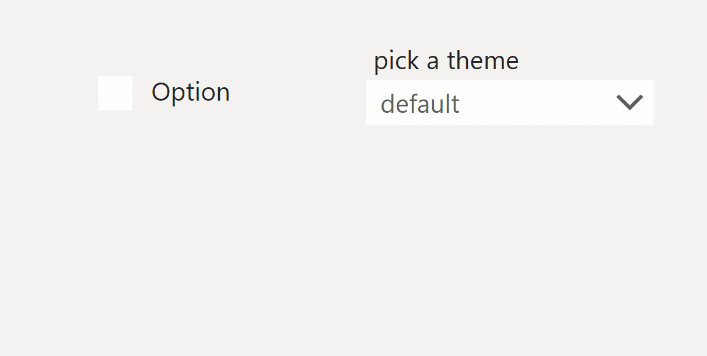

### Dropdown

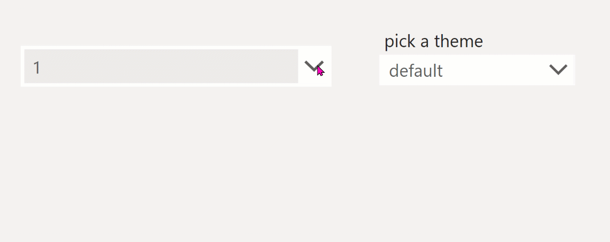

The Dropdown should have a primary-colored line at the bottom, this is not achievable out-of-the box, I created a [Dropdown component](#dropdown-component) for this design requirement.

### Combobox

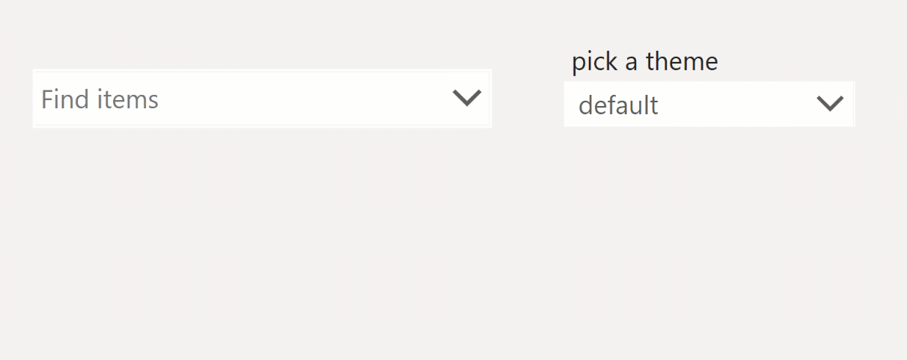

The Combobox should have a primary-colored line at the bottom, this is not achievable out-of-the box, I created a [Combobox component](#combobox-component) for this design requirement.

### Datatable

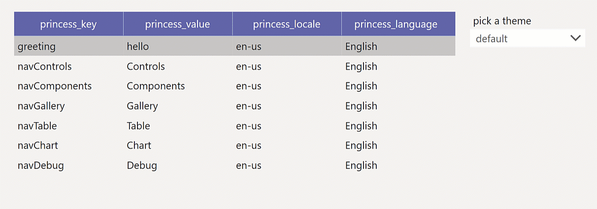

### Datepicker

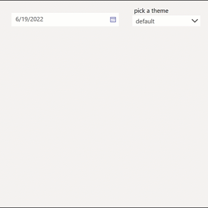

The DatePicker is a bit stylable, however the background color of the calendar can't be changed, which doesn't look good in dark mode or high contrast mode. I built a [Datepicker component](#datepicker-component) to tackle this.

### Icons

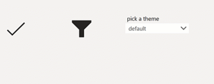

### Listbox

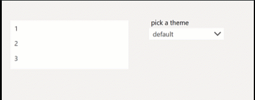

### Radiobutton

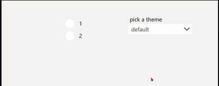

### Rating

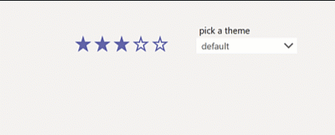

### Slider

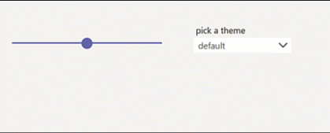

The slider looks as it should, still I created some components that make use of it: Check out [Likert component](#likert-component) and [Donut chart component](#donut-chart-component)

### Textlabel


### TextInput

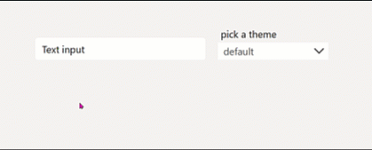

The Textinput should have a primarycolored line at the bottom, this is not achievable out-of-the box, I created a [Textinput component](#Textinput-component) for this design requirement.

### Toggle

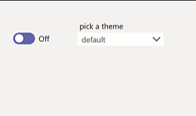

## Components

The provided components refer to the custom theme with custom properties.

### Carousel component


### Coachmark component

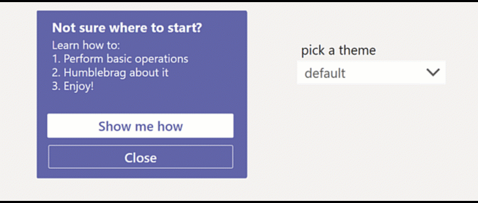

### Combobox component

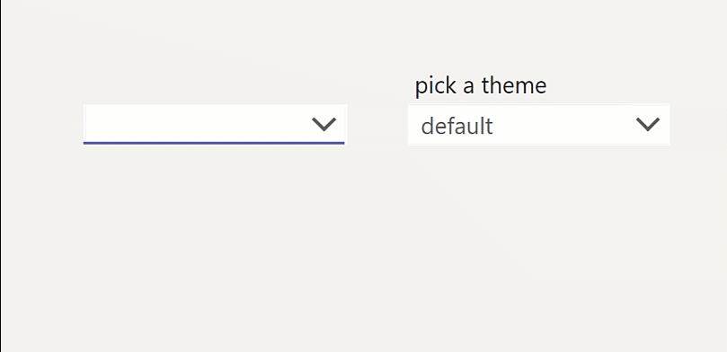

### Donut chart component

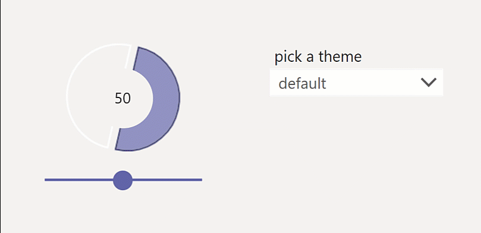

### Datepicker component

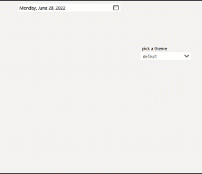

### Dropdown component

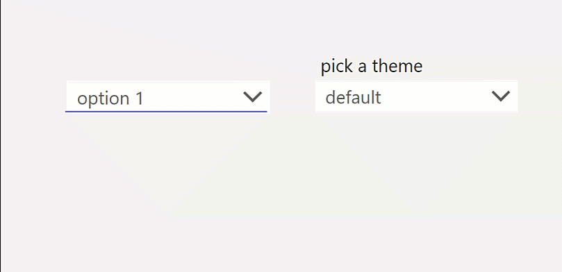

### Likert component

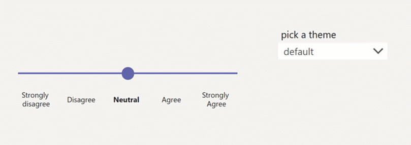

### Textinput component

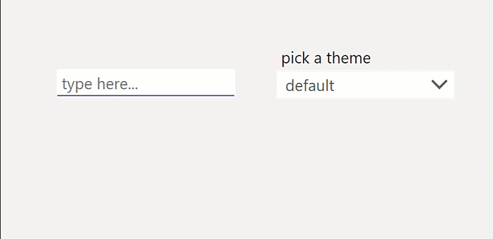

### Toast component


### Sidebar navigation component

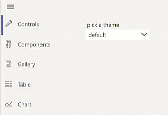

## Screens

### List screen


#### Empty list screen


### Chart screen

I also manipulated the primary palette which determines which colors are shown in charts.

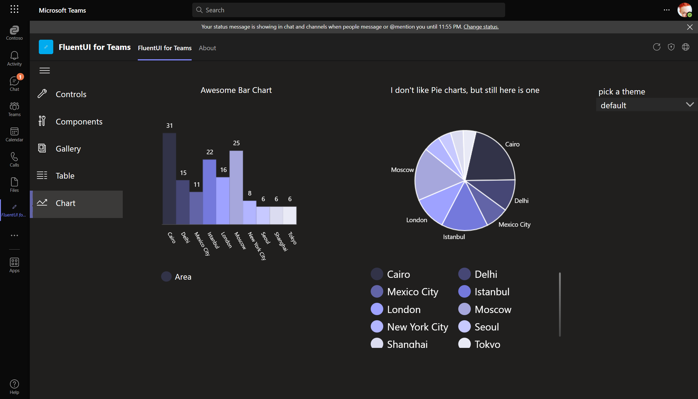

## Minimal Path to Awesome

* [Download](https://github.com/pnp/powerapps-samples/raw/main/samples/fluentui-for-teams-theme/solution/fluentui-for-teams-theme.msapp) the `.msapp` from the [`solution`](https://github.com/pnp/powerapps-samples/tree/main/samples/fluentui-for-teams-theme/solution) folder
* Within **Power Apps Studio**, use the `.msapp` file using **File** > **Open** > **Browse** and select the `.msapp` file you just downloaded.
* Save and Publish

## Using the Source Code

You can also use the [Power Apps CLI](https://docs.microsoft.com/powerapps/developer/data-platform/powerapps-cli) to pack the source code by following these steps::

* Clone the repository to a local drive
* Pack the source files back into `.msapp` file

``` bash
pac canvas pack --sources pathtosourcefolder --msapp pathtomsapp
```

* Make sure to replace `pathtosourcefolder` to point to the path to this sample's `sourcecode` folder, and `pathtomsapp` to point to the path of this solution's `.msapp` file (located under the `solution` folder)
* Within **Power Apps Studio**, use the `.msapp` file using **File** > **Open** > **Browse** and select the `.msapp` file you just packed.

## Disclaimer

**THIS CODE IS PROVIDED *AS IS* WITHOUT WARRANTY OF ANY KIND, EITHER EXPRESS OR IMPLIED, INCLUDING ANY IMPLIED WARRANTIES OF FITNESS FOR A PARTICULAR PURPOSE, MERCHANTABILITY, OR NON-INFRINGEMENT.**

## Support

While we don't support samples, if you encounter any issues while using this sample, you can [create a new issue](https://github.com/pnp/powerapps-samples/issues/new?assignees=&labels=Needs%3A+Triage+%3Amag%3A%2Ctype%3Abug-suspected&template=bug-report.yml&sample=fluentui-custom-theme&authors=@fabiofranzini&title=fluentui-custom-theme%20-%20).

For questions regarding this sample, [create a new question](https://github.com/pnp/powerapps-samples/issues/new?assignees=&labels=Needs%3A+Triage+%3Amag%3A%2Ctype%3Abug-suspected&template=question.yml&sample=fluentui-custom-theme&authors=@fabiofranzini&title=fluentui-custom-theme%20-%20).

Finally, if you have an idea for improvement, [make a suggestion](https://github.com/pnp/powerapps-samples/issues/new?assignees=&labels=Needs%3A+Triage+%3Amag%3A%2Ctype%3Abug-suspected&template=suggestion.yml&sample=fluentui-custom-theme&authors=@fabiofranzini&title=fluentui-custom-theme%20-%20).

## For more information

- [Overview of creating apps in Power Apps](https://docs.microsoft.com/powerapps/maker/)
- [Power Apps canvas apps documentation](https://docs.microsoft.com/en-us/powerapps/maker/canvas-apps/)

